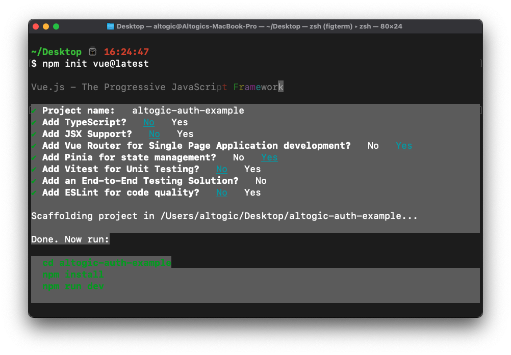
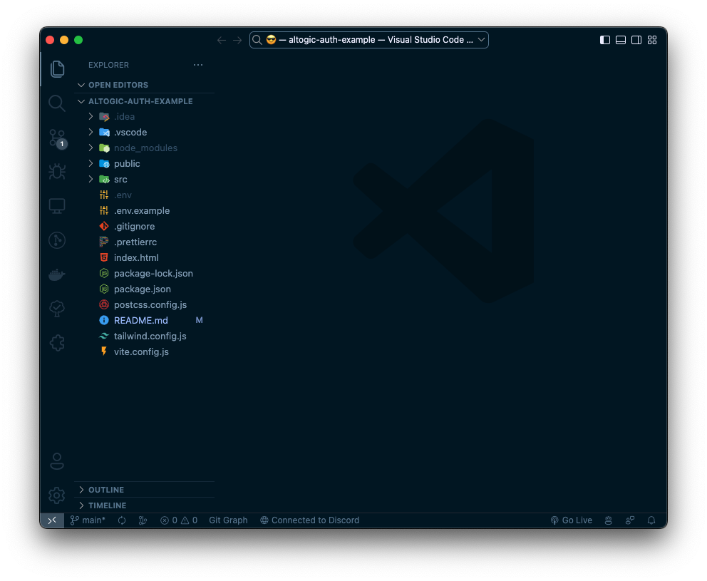
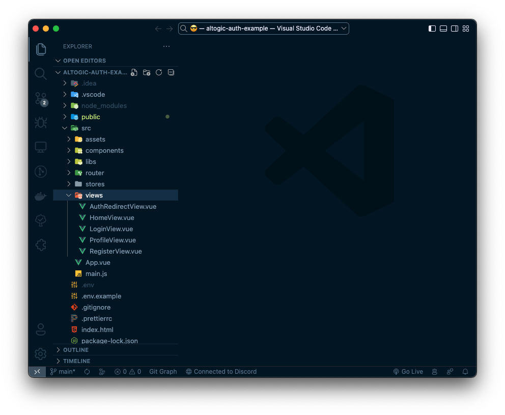

# Authentication with Vue.js & Altogic

## Introduction
**Altogic** is a Backend as a Service (BaaS) platform and provides a variety of services in modern web and mobile development. Most of the modern applications using React or other libraries/frameworks require to know the identity of a user. And this necessity allows an app to securely save user data and session in the cloud and provide more personalized functionalities and views to users.

Altogic has an Authentication service that integrates and implements well in JAMstack apps. It has a ready-to-use Javascript client library, and it supports many authentication providers such as email/password, phone number, magic link, and OAuth providers like Google, Facebook, Twitter, Github, etc.,

In this tutorial, we will implement email/password authentication with Vue.js and take a look how as a Vue developer we build applications and integrate with Altogic Authentication.

After completion of this tutorial, you will learn:

* How to create sample screens to display forms like login and signup.
* How to create a home screen and authorize only logged-in users.
* How to create different routes using the vue-router.
* How to create an authentication flow by conditionally rendering between these pages whether a user is logged-in or not.
* How to authenticate users using magic link
* How to update user profile info and upload a profile picture
* And we will integrate Altogic authentication with the email/password method.
  
If you are new to Vue applications, this tutorial is definitely for you to understand the basics and even advanced concepts.


## Prerequisites
* Altogic account (if you have not one yet, you can create an account by sign-in up to **Altogic**)
* Familiarity with the command line
* Any text editor or IDE (WebStorm, VsCode, Sublime, Atom, etc.)
* Node.js version 16.0 or higher
* Basic knowledge of Javascript
* Basic knowledge of Vue 3
* Basic knowledge of Vue 3 Composition API
* Basic knowledge of Vue Router 4

## Creating an Altogic App
We will use Altogic as a backend service platform, so let’s visit [Altogic Designer](https://designer.altogic.com/) and create an account.


After creating an account, you will see the workspace where you can access your apps.

Click + New app and follow the instructions;

1. In the App name field, enter a name for the app.
2. Enter your subdomain.
3. Choose the deployment location.
4. And select your free execution environment pricing plan.


Then click Next and select Basic Authentication template. This template is creates a default user model for your app which is required by [Altogic Client Library](https://github.com/altogic/altogic-js) to store user data and manage authentication.

Then click Next and select Basic Authentication template. This template is based on session authentication and highly recommended to secure your apps.


Then click Next to confirm and create an app.

Awesome! We have created our application; now click/tap on the **newly created app to launch the Designer.**

> This is the only configuration we need to do in Altogic Designer. In order to access the app and use the Altogic client library, we should get envUrl and clientKey of this app.
Click the **Home** icon at the left sidebar to copy the envUrl and clientKey.


Once the user created successfully, our Vue.js app will route the user to the Verification page, and a verification email will be sent to the user’s email address. When the user clicks the link in the mail, the user will navigate to the redirect page to grant authentication rights. After successfully creating a session on the Redirect page, users will be redirected to the Home page.

## Quick Tip
> If you want, you can deactivate or customize the mail verification from **App Settings -> Authentication** in Logic Designer.

## Create a Vue 3 project
Make sure you have an up-to-date version of Node.js installed, then run the following command in your command line
```bash
npm init vue@latest
```

I showed you which options to choose in the image I will give you below. You can choose the same options as I did. 


Then paste the code below into terminal and press enter.

```bash
    cd altogic-auth-example && npm i altogic && npm run dev
```
## Open the project in your editor or IDE and Start Coding
Select your favorite editor or IDE. I will use VSCode. You can use anything you want.


Let's create some views in src/views folder as below for vue-router
* HomeView.vue
* LoginView.vue
* RegisterView.vue 
* ProfileView.vue
* AuthRedirectView.vue



## Let's create an Altogic Client instance
Create a folder named **libs** in the **src** folder of your project and put a file named **altogic.js** in it. Then paste the code below into the file.

```js
// src/libs/altogic.js
import { createClient } from 'altogic';

const ENV_URL = import.meta.env.VITE_ALTOGIC_ENV_URL; // get the env url from .env file
const CLIENT_KEY = import.meta.env.VITE_ALTOGIC_CLIENT_KEY; // get the client key from .env file
const API_KEY = import.meta.env.VITE_ALTOGIC_API_KEY; // get the api key from .env file

const altogic = createClient(ENV_URL, CLIENT_KEY, {
	apiKey: API_KEY,
});

export default altogic;
```

## Let's create authentication store
Create a folder named **stores** in the **src** folder of your project and put a file named **auth.js** in it. Then paste the code below into the file.

```js
// src/stores/auth.js
import { computed, ref } from 'vue';
import { defineStore } from 'pinia';
import altogic from '@/libs/altogic';
import router from '../router';

export const useAuthStore = defineStore('auth', () => {
	const _user = ref(altogic.auth.getUser());
	const _session = ref(altogic.auth.getSession());

	function setUser(user) {
		_user.value = user;
		altogic.auth.setUser(user);
	}
	function setSession(session) {
		_session.value = session;
		altogic.auth.setSession(session);
	}
	async function logout() {
		await altogic.auth.signOut();
		setUser(null);
		setSession(null);
		await router.push({ name: 'login' });
	}

	const user = computed(() => _user.value);
	const session = computed(() => _user.value);

	return { user, session, setUser, setSession, logout };
});
```

## Let's create router
Open the **src/router/index.js** file and paste the code below into the file.
```js
// src/router/index.js
import { createRouter, createWebHistory } from 'vue-router';
import HomeView from '../views/HomeView.vue';
import { useAuthStore } from '@/stores/auth';

const router = createRouter({
    history: createWebHistory(import.meta.env.BASE_URL),
    routes: [
        {
            path: '/',
            name: 'home',
            component: HomeView,
            meta: { requiresGuest: true },
        },
        {
            path: '/profile',
            name: 'profile',
            component: () => import('../views/ProfileView.vue'),
            meta: { requiresAuth: true },
        },
        {
            path: '/login',
            name: 'login',
            component: () => import('../views/LoginView.vue'),
            meta: { requiresGuest: true },
        },
        {
            path: '/login-with-magic-link',
            name: 'magic-login',
            component: () => import('../views/LoginWithMagicLinkView.vue'),
            meta: { requiresGuest: true },
        },
        {
            path: '/register',
            name: 'register',
            component: () => import('../views/RegisterView.vue'),
            meta: { requiresGuest: true },
        },
        {
            path: '/auth-redirect',
            name: 'auth-redirect',
            component: () => import('../views/AuthRedirectView.vue'),
            meta: { requiresGuest: true },
        },
    ],
});
router.beforeEach((to, from) => {
    const auth = useAuthStore();
    if (to.meta.requiresAuth && !auth.user) {
        return {
            name: 'login',
        };
    }
    if (to.meta.requiresGuest && auth.user) {
        return {
            name: 'profile',
        };
    }
});

export default router;
```


## Replacing the remaining files
If everything is ok, replace the codes I will give you with the ones in your project.
 
### Home Page
```vue
<!-- src/views/HomeView.vue -->
<template>
    <div class="flex items-center justify-center gap-4 h-screen">
        <router-link class="border px-4 py-2 font-medium text-xl" :to="{ name: 'magic-login' }">Login With Magic Link</router-link>
        <router-link class="border px-4 py-2 font-medium text-xl" :to="{ name: 'login' }">Login</router-link>
        <router-link class="border px-4 py-2 font-medium text-xl" :to="{ name: 'register' }">Register</router-link>
    </div>
</template>

```

### Login Page
```vue
<!-- src/views/LoginView.vue -->
<script setup>
import { ref } from 'vue';
import altogic from '@/libs/altogic';
import { useAuthStore } from '@/stores/auth';
import { useRouter } from 'vue-router';

const auth = useAuthStore();
const router = useRouter();
const loading = ref(false);
const email = ref('');
const password = ref('');
const errors = ref(null);

async function loginHandler() {
	loading.value = true;
	errors.value = null;
	const { user, session, errors: apiErrors } = await altogic.auth.signInWithEmail(email.value, password.value);
	if (apiErrors) {
		errors.value = apiErrors;
		loading.value = false;
	} else {
		auth.setUser(user);
		auth.setSession(session);
		await router.push({ name: 'profile' });
	}
}
</script>

<template>
	<section class="flex flex-col items-center justify-center h-96 gap-4">
		<form @submit.prevent="loginHandler" class="flex flex-col gap-2 w-full md:w-96">
			<h1 class="self-start text-3xl font-bold">Login to your account</h1>

			<div v-if="errors" class="bg-red-600 text-white text-[13px] p-2">
				<p v-for="(error, index) in errors.items" :key="index">{{ error.message }}</p>
			</div>

			<input v-model="email" type="email" placeholder="Type your email" required />
			<input v-model="password" type="password" placeholder="Type your password" required />
			<div class="flex justify-between gap-2">
				<router-link class="text-indigo-600" :to="{ name: 'register' }"
				>Don't have an account? Register now</router-link
				>
				<button
					:disabled="loading"
					type="submit"
					class="border py-2 px-3 border-gray-500 hover:bg-gray-500 hover:text-white transition"
				>
					Login
				</button>
			</div>
		</form>
	</section>
</template>
```

### Login With Magic Link Page
```vue
<!-- src/views/LoginWithMagicLinkView.vue -->
<script setup>
import { ref } from 'vue';
import altogic from '@/libs/altogic';
import { useRouter } from 'vue-router';

const router = useRouter();

const successMessage = ref('');
const loading = ref(false);
const email = ref('');
const errors = ref(null);

async function loginHandler() {
    loading.value = true;
    errors.value = null;
    const { errors: apiErrors } = await altogic.auth.sendMagicLinkEmail(email.value);
    loading.value = false;
    if (apiErrors) {
        errors.value = apiErrors;
    } else {
        email.value = '';
        successMessage.value = 'Email sent! Check your inbox.';
    }
}
</script>

<template>
    <section class="flex flex-col items-center justify-center h-96 gap-4">
        <form @submit.prevent="loginHandler" class="flex flex-col gap-2 w-full md:w-96">
            <h1 class="self-start text-3xl font-bold">Login with magic link</h1>
            <div v-if="successMessage" class="bg-green-600 text-white text-[13px] p-2">
                {{ successMessage }}
            </div>
            <div v-if="errors" class="bg-red-600 text-white text-[13px] p-2">
                <p v-for="(error, index) in errors.items" :key="index">{{ error.message }}</p>
            </div>

            <input v-model="email" type="email" placeholder="Type your email" required />
            <div class="flex justify-between gap-4 items-start">
                <router-link class="text-indigo-600" :to="{ name: 'register' }"
                >Don't have an account? Register now</router-link
                >
                <button
                    :disabled="loading"
                    type="submit"
                    class="border py-2 px-3 border-gray-500 hover:bg-gray-500 hover:text-white transition shrink-0"
                >
                    Send magic link
                </button>
            </div>
        </form>
    </section>
</template>
```

### Register Page
```vue
<!-- src/views/RegisterView.vue -->
<script setup>
import { ref } from 'vue';
import altogic from '@/libs/altogic';
import { useAuthStore } from '@/stores/auth';
import { useRouter } from 'vue-router';

const auth = useAuthStore();
const router = useRouter();
const loading = ref(false);
const email = ref('');
const name = ref('');
const password = ref('');
const errors = ref(null);
const isNeedToVerify = ref(false);

async function registerHandler() {
	loading.value = true;
	errors.value = null;
	isNeedToVerify.value = false;

	const {
		user,
		session,
		errors: apiErrors,
	} = await altogic.auth.signUpWithEmail(email.value, password.value, name.value);

	if (apiErrors) {
		errors.value = apiErrors;
		return;
	}

	email.value = '';
	password.value = '';
	name.value = '';

	if (!session) {
		isNeedToVerify.value = true;
		return;
	}

	auth.setSession(session);
	auth.setUser(user);
	await router.push({ name: 'profile' });
}
</script>

<template>
	<section class="flex flex-col items-center justify-center h-96 gap-4">
		<form @submit.prevent="registerHandler" class="flex flex-col gap-2 w-full md:w-96">
			<h1 class="self-start text-3xl font-bold">Create an account</h1>

			<div v-if="isNeedToVerify" class="bg-green-500 text-white p-2">
				Your account has been created. Please check your email to verify your account.
			</div>

			<div v-if="errors" class="bg-red-600 text-white text-[13px] p-2">
				<p v-for="(error, index) in errors.items" :key="index">{{ error.message }}</p>
			</div>

			<input v-model="email" type="email" placeholder="Type your email" required />
			<input v-model="name" type="text" placeholder="Type your name" required />
			<input v-model="password" type="password" placeholder="Type your password" required />
			<div class="flex justify-between gap-2">
				<router-link class="text-indigo-600" :to="{ name: 'login' }">Already have an account?</router-link>
				<button
					type="submit"
					class="border py-2 px-3 border-gray-500 hover:bg-gray-500 hover:text-white transition"
				>
					Register
				</button>
			</div>
		</form>
	</section>
</template>
```

### Profile Page
```vue
<!-- src/views/ProfileView.vue -->
<script setup>
import { useAuthStore } from '@/stores/auth';
const auth = useAuthStore();
</script>

<template>
	<section class="h-screen py-4 space-y-4 flex flex-col text-center items-center">
		<h1 class="text-3xl">Hello, {{ auth.user.name }}</h1>
		<button @click="auth.logout" class="bg-gray-400 rounded py-2 px-3 text-white">Logout</button>
	</section>
</template>
```

### Auth Redirect Page
We use this page for verify the user's email address and **Login With Magic Link Authentication**.
```vue
<!-- src/views/AuthRedirectView.vue -->
<script setup>
import { useAuthStore } from '@/stores/auth';
import { useRoute, useRouter } from 'vue-router';
import { onMounted, ref } from 'vue';
import altogic from '@/libs/altogic';

const auth = useAuthStore();
const route = useRoute();
const router = useRouter();
const errors = ref(null);
const { access_token } = route.query;

onMounted(() => {
	loginWithToken();
});

async function loginWithToken() {
	const { user, session, errors: apiErrors } = await altogic.auth.getAuthGrant(access_token);
	if (!apiErrors) {
		auth.setSession(session);
		auth.setUser(user);
		await router.push({ name: 'profile' });
	} else {
		errors.value = apiErrors;
	}
}
</script>
<template>
	<section class="h-screen flex flex-col gap-4 justify-center items-center">
		<div class="text-center" v-if="!errors">
			<p class="text-6xl">Please wait</p>
			<p class="text-3xl">You're redirecting to your profile...</p>
		</div>
		<div class="text-center text-red-500 text-3xl" v-else>
			<p v-for="(error, index) in errors.items">{{ error.message }}</p>
		</div>
	</section>
</template>
```

## Upload Profile Photo
Let's create a Vue component for user can upload a profile photo.
```vue
<!-- src/components/Avatar.vue -->
<template>
	<div>
		<figure class="flex flex-col gap-4 items-center justify-center py-2">
			<picture class="border rounded-full w-24 h-24 overflow-hidden">
				
			</picture>
		</figure>
		<div class="flex flex-col gap-4 justify-center items-center">
			<label class="border p-2 cursor-pointer">
				<span v-if="loading">Uploading...</span>
				<span v-else>Change Avatar</span>
				<input :disabled="loading" class="hidden" type="file" accept="image/*" @change="changeHandler" />
			</label>
			<div class="bg-red-500 p-2 text-white" v-if="errors">
				{{ errors }}
			</div>
		</div>
	</div>
</template>

<script setup>
import { useAuthStore } from '@/stores/auth';
import altogic from '@/libs/altogic';
import { computed, ref } from 'vue';
const auth = useAuthStore();
const loading = ref(false);
const errors = ref(null);

const userPicture = computed(() => {
	return auth.user.profilePicture || `https://ui-avatars.com/api/?name=${auth.user.name}&background=0D8ABC&color=fff`;
});

async function changeHandler(e) {
	const file = e.target.files[0];
	e.target.value = null;
	if (!file) return;
	loading.value = true;
	errors.value = null;
	try {
		const { publicPath } = await uploadAvatar(file);
		const user = await updateUser({ profilePicture: publicPath });
		auth.setUser(user);
	} catch (error) {
		errors.value = error.message;
	} finally {
		loading.value = false;
	}
}

async function uploadAvatar(file) {
	const { data, errors } = await altogic.storage.bucket('root').upload(file.name, file);
	if (errors) {
		throw new Error("Couldn't upload avatar, please try again later");
	}
	return data;
}
async function updateUser(data) {
	const { data: user, errors } = await altogic.db.model('users').object(auth.user._id).update(data);
	if (errors) {
		throw new Error("Couldn't update user, please try again later");
	}
	return user;
}
</script>
```

## Use the Avatar component on the profile view
And then we can add the component to the Profile page
```vue
<!-- src/views/ProfileView.vue -->
<script setup>
import { useAuthStore } from '@/stores/auth';
import Avatar from '@/components/Avatar.vue';
const auth = useAuthStore();
</script>

<template>
	<section class="h-screen py-4 space-y-4 flex flex-col text-center items-center">
		<Avatar />
		<h1 class="text-3xl">Hello, {{ auth.user.name }}</h1>
		<button @click="auth.logout" class="bg-gray-400 rounded py-2 px-3 text-white">Logout</button>
	</section>
</template>
```

## Conclusion
Congratulations!✨

You had completed the most critical part of the Authentication flow, which includes private routes, sign-up, sign-in, and sign-out operations.

If you have any questions about Altogic or want to share what you have built, please post a message in our [community forum](https://community.altogic.com/home) or [discord channel](https://discord.gg/zDTnDPBxRz).

